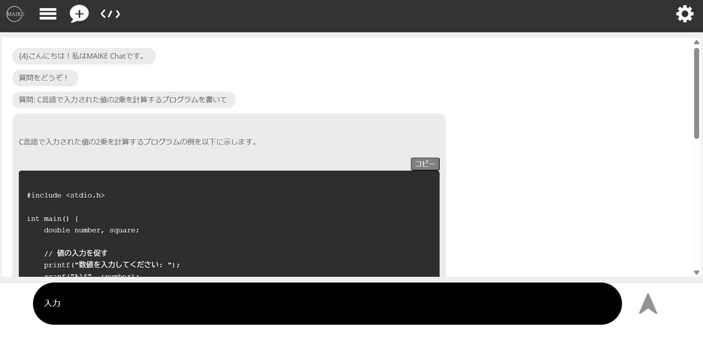
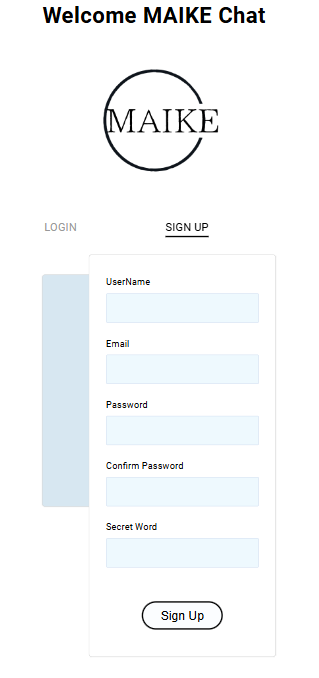
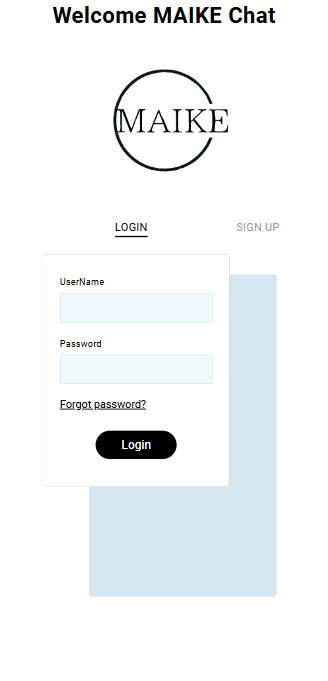
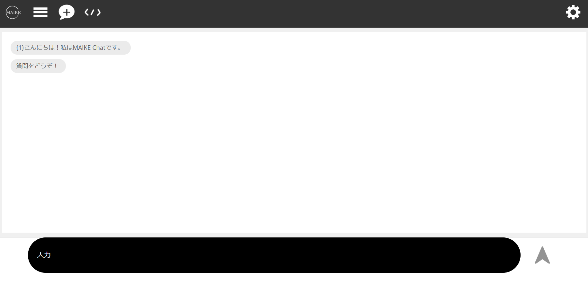
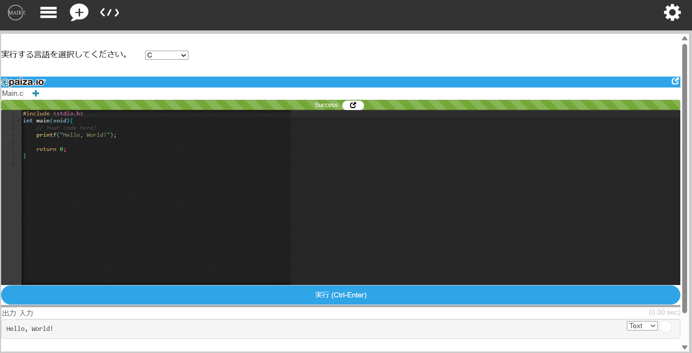
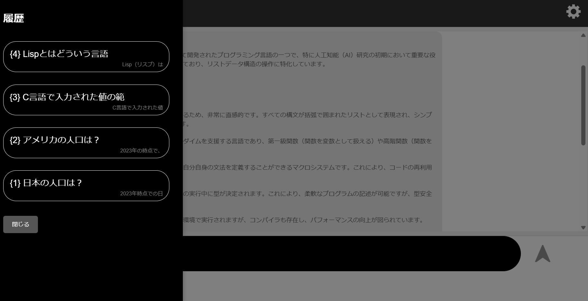

[](https://classroom.github.com/a/Fw6BNX-f)
[](https://classroom.github.com/open-in-codespaces?assignment_repo_id=17388676)

# MAIKE Chat



OpenAI APIを用いたチャットアプリです

### 主な機能：
- サインアップ・ログイン機能    
  ユーザー登録画面で任意のユーザーを登録可能。    
  パスワードを忘れた場合でも、`SecretWord`を入力することによりパスワード変更を可能にした
- チャット機能    
  [OpenAI API](https://openai.com/index/openai-api/)を用いて`gpt-4o-mini`にテキストを送信し、その返答を[botUI](https://botui.org/)でチャットとして表示
- コード実行機能    
  [paiza.io](https://paiza.io/ja)を使用して以下の言語に対応させた    
  C言語・C#・C++・Python3・Python2・生JavaScript・Java・Ruby・PHP
- チャット履歴機能    
    Chat Historyボタンを押すことによりチャット履歴を確認及び、選択可能

### 各機能ごとのプレビュー：
- サインアップ・ログイン機能    
  
  
- チャット機能    
  
- コード実行機能
  
- チャット履歴機能    
      

<br>

# インストール方法
pythonの仮想環境を作成(hogeは仮想環境名)
```bash
sudo apt install python3-venv
python3 -m venv ~/hoge
```

仮想環境を作動
```bash
source ~/venv/hoge/bin/activate
```

コマンドプロンプトの先頭に (hoge) が表示されれば成功<br>
<br>
仮想環境を停止させる
```bash
deactivate
```
コマンドプロンプトの先頭の (hoge) が非表示になれば成功<br>
<br>
仮想環境に必要なパッケージをインストール<br>
仮想環境を作動させて、以下のコマンドを実行
```bash
pip install eel openai mysql-connector-python bcrypt redis
```
