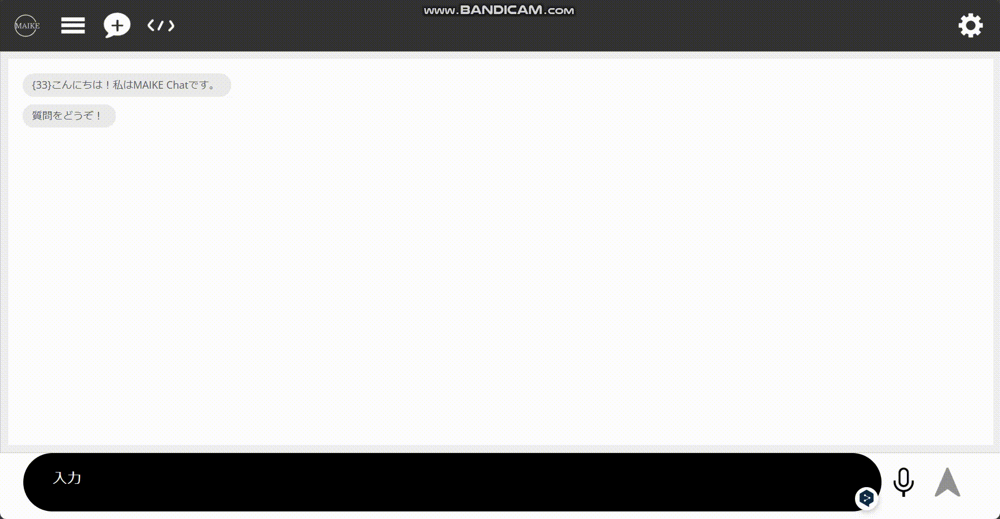

[](https://classroom.github.com/a/Fw6BNX-f)
[](https://classroom.github.com/open-in-codespaces?assignment_repo_id=17388676)


# MAIKE Chat


<br />



`OpenAI API`を用いたチャットアプリです

## 目次
- [主な機能](#主な機能)
    - [サインアップ・ログイン機能](#サインアップ・ログイン機能)
    - [チャット機能](#チャット機能)
    - [コード実行機能](#コード実行機能)
    - [チャット履歴機能](#チャット履歴機能)
- [使い方](#使い方)
    - [1. リポジトリをクローン](#1-リポジトリをクローン)
    - [2. python3の設定](#2-python3の設定)
    - [3. 環境変数の設定](#3-環境変数の設定)
    - [4. データベースの設定](#4-データベースの設定)
    - [5. アプリの起動](#5-アプリの起動)
- [環境](#環境)
    - [開発環境](#開発環境)
    - [動作確認済みのpythonモジュールバージョン](#動作確認済みのpythonモジュールバージョン)
- [ライセンス](#ライセンス)

# 主な機能
- ### サインアップ・ログイン機能    
  ユーザー登録画面で任意のユーザーを登録可能。    
  パスワードを忘れた場合でも、`SecretWord`を入力することによりパスワード変更を可能にした
- ### チャット機能    
  [OpenAI API](https://openai.com/index/openai-api/)を用いて`gpt-4o-mini`にテキストを送信し、その返答を[botUI](https://botui.org/)でチャットとして表示
- ### コード実行機能    
  [paiza.io](https://paiza.io/ja)を使用して以下の言語に対応させた    
  - 🟦 C言語  
  - 🟧 C#  
  - 🟨 C++  
  - 🐍 Python3 / Python2  
  - 🌐 生JavaScript  
  - ☕ Java  
  - 💎 Ruby  
  - 🐘 PHP
- ### チャット履歴機能    
    `Chat Historyボタン`を押すことによりチャット履歴を確認及び、選択可能

<br>

# 使い方   
### 1. リポジトリをクローン    
- httpsでクローン    
    ```bash
    git clone https://github.com/IS2ProjectPractice1/lesson-5-team-development-mike-1.git
    cd lesson-5-team-development-mike-1
    ```
- sshでクローン    
    ```bash
    git clone git@github.com:IS2ProjectPractice1/lesson-5-team-development-mike-1.git
    cd lesson-5-team-development-mike-1
    ```
### 2. python3の設定    
- 仮想環境を作成(`hoge` は仮想環境名です)  
    ```bash
    sudo apt install python3-venv
    python3 -m venv ~/hoge # "hoge" の部分を好きな名前に変更できます
    ```
- 仮想環境を作動
    ```bash
    source ~/hoge/bin/activate
    ```
- 仮想環境を停止
    ```bash
    deactivate
    ```
- パッケージをインストール    
    ```bash
    source ~/hoge/bin/activate
    pip install eel openai mysql-connector-python bcrypt redis python-dotenv
    ```
### 3. 環境変数の設定
1. [`.env.sample`](./.env.sample)をコピーして`.env`ファイルを作成
    ```bash
    cp .env.sample .env
    ```
2. `.env`ファイルを編集    
    `.env`ファイルに以下のように自分のAPIキーやデータベース設定を入力
    ```bash
    # .env

    # OpenAI APIキー
    MAIKE_OPENAI_API_KEY=your-api-key-here

    # MySQLの設定
    MAIKE_DB_HOST=localhost
    MAIKE_DB_USER=your-database-user
    MAIKE_DB_PASSWORD=your-database-password
    MAIKE_DB_NAME=your-database-name

    # Redisの設定
    MAIKE_REDIS_HOST=localhost
    MAIKE_REDIS_PORT=6379
    MAIKE_REDIS_DB=0
    ```
3. `.env`ファイルを適応
    ```bash
    source .env
    ```
### 4. データベースの設定
[db_setup.sh](./db_setup.sh)を実行
```bash
chmod +x ./db_setup.sh
./db_setup.sh
```
### 5. アプリの起動
```bash
python3 main.py
```

# 環境
### 開発環境
- Python 3.10.12
- WSL2
- Raspberry Pi 3B
### 動作確認済みのpythonモジュールバージョン
- [Eel 0.18.1](https://github.com/python-eel/Eel)
- [openai 1.58.1](https://platform.openai.com/docs/overview)
- [mysql-connector-python 9.1.0](https://github.com/mysql/mysql-connector-python)
- [bcrypt 4.2.1](https://github.com/pyca/bcrypt)
- [redis 5.2.1](https://github.com/redis/redis)
- [python-dotenv 1.0.1](https://github.com/theskumar/python-dotenv)

# ライセンス
このプロジェクトは [MIT License](LICENSE) のもとで公開されています。
